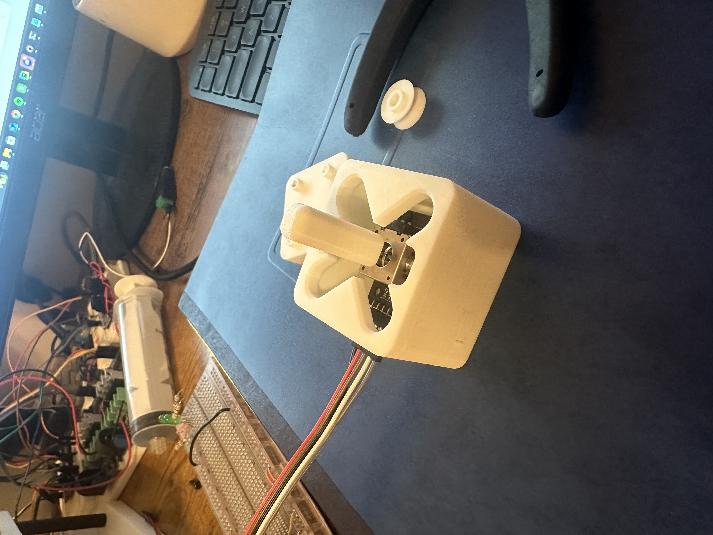

Logbook
---
---
12/08/2024
---
- created wiring diagram

- created bill of materials
- wrote up assembly instructions
- pretty much done with [report/documentation](Origami%20Worm%20Robot%20Report%20and%20Documentation_FALL24.docx), might comment on main program

12/07/2024
---
- working on report/documentation
- had to fix some paths for images on log that got off because I reorganized some files
- tried new pad, pretty sure it is 25 degrees at 4 mm height. Works really well on carpet, going to try on rough outdoor surface

[video of robot on carpet](https://cpslo-my.sharepoint.com/:v:/g/personal/apcarr_calpoly_edu/EZ3gfSpz0YdHlWizx2pAg3gBb_xeV1YFyOWcL83Z5IEy0Q?nav=eyJyZWZlcnJhbEluZm8iOnsicmVmZXJyYWxBcHAiOiJPbmVEcml2ZUZvckJ1c2luZXNzIiwicmVmZXJyYWxBcHBQbGF0Zm9ybSI6IldlYiIsInJlZmVycmFsTW9kZSI6InZpZXciLCJyZWZlcnJhbFZpZXciOiJNeUZpbGVzTGlua0NvcHkifX0&e=CAm8it)

- works on rough surface relatively well. Better than before for sure.

[video on standard garage concrete](https://cpslo-my.sharepoint.com/:v:/g/personal/apcarr_calpoly_edu/EVyeC1qBWZ9LjJJ2trlWG6QBVoEVjFBpGhsD8ZwvbOOz0Q?nav=eyJyZWZlcnJhbEluZm8iOnsicmVmZXJyYWxBcHAiOiJPbmVEcml2ZUZvckJ1c2luZXNzIiwicmVmZXJyYWxBcHBQbGF0Zm9ybSI6IldlYiIsInJlZmVycmFsTW9kZSI6InZpZXciLCJyZWZlcnJhbFZpZXciOiJNeUZpbGVzTGlua0NvcHkifX0&e=EE4tMg)

[video on rougher more irregular concrete](https://cpslo-my.sharepoint.com/:v:/g/personal/apcarr_calpoly_edu/EYgH6j8teHZAugXCq2LXksoB2CPt29aTcvvlFOFw1zrG9Q?nav=eyJyZWZlcnJhbEluZm8iOnsicmVmZXJyYWxBcHAiOiJPbmVEcml2ZUZvckJ1c2luZXNzIiwicmVmZXJyYWxBcHBQbGF0Zm9ybSI6IldlYiIsInJlZmVycmFsTW9kZSI6InZpZXciLCJyZWZlcnJhbFZpZXciOiJNeUZpbGVzTGlua0NvcHkifX0&e=G0bfJv)

- one thing i realized during testing: there is a balance between angle of the pad, the stiffness of the teeth, and the surface. This balance changes the performance. if the angle is very small, the teeth won't grab. if the angle is too large, the teeth won't grab. if the teeth are too weak, they will just fall down and not grab. If they are too stiff, they will not grab. A rougher surface seems to always be a good thing. Should try on sand paper to see

12/06/2024
---
- working on report/documentation

12/03/2024
---
- going to test more angled friction pads. Previous ones were at a 40 degree angle. New ones are 30 and 25. I am also make these longer. Previous were 3 mm tall, new ones are 4 and 4.5 mm tall.
- these should be less stiff and should deform and work closer to how we think they should
- the auto-orient showed me that I can print them standing up in a different way than I was thinking. I am putting 1 layer of raft because I feel it'll be unstable. Since I can print it this way, I am going to try 15 degrees. I had to reduce the amount of teeth from 6 to 5 for this.

11/28/2024
---
- from last meeting, motion seems to work better with short and fast compression cycles. This is when the robot sits more flat but has torques curling the robot into the ground.
- The robot often gets stuck on one pad, but a max compression can sometimes set it free
- this [paper](https://ieeexplore.ieee.org/abstract/document/6266749?casa_token=2NHwqPMrAp0AAAAA:Cy2g7GQio3avqqqwebAlX3SHQyJ9VryApqf8gQ8An6_T1wlNR-Nc-jH1ESd8uGxClsHmPrb_)
uses a single leg friction pad similar to our design. I think we could use something similar with longer legs as they will be much flexible and can deform how we want. 
- our motion is called peristaltic
- more worm angle seems to be cancelled out with less friction pad angle. So with a very large worm angle, we could have less worm angle and vice versa. Depending if we want less caterpillar like motion
- [OSCAR](https://www.ideals.illinois.edu/items/118254) uses a small locking wheel to get directional movement

11/20/2024
---
- new controller works very good, normal compression and decompression works smoothly. The controller also makes it easy to adjust one motor on the fly which also allows turning motion. It is up to the standard to complete reliable tests.
- tested it outside again, worked about the same as before --> not well. The surface was somewhat uneven but it looked more like the friction pads were not working as designed. The robot being so light allows the wires to make some impact. I tried to reduce it as much as possible but it is hard with stiff wires.
- I tried lowering the anchor point of the tether, and it did not make much of a difference. The friction pads definetly work in creating friction but one pad dominates and won't move either way. Or the pads will be at a similar friction force which makes both sides slide during compression.

Current motion cases:

1. compression --> both slip --> decompression --> one holds slips slightly less than other --> very small amount of forward displacement
2. compression --> one holds, other slips --> decompression --> same one holds, same one slips --> no motion

I see two possibilities for these problems:
1. theoretically sound for forward motion but very hard to create in the field
2. fundamentally and theoretically flawed for forward motion

- Directional friction is sound so I think it is likely that this would work if perfectly implemented, but is just very difficult to mitigate all the negative factors
- For the gecko pads, the implementation and overall movement may need to change. Similar to how an inch worm moves, a lifting, moving forward then planting approach would be ideal. It will be hard to actuate and move one side at a time. We don't have a way to only move one pad a time without directional friction.
- controller with no delay does not function. I am pretty sure this is do limitations of the motor driver. 

11/18/2024
---
- wrote new velocity control as shown in flow diagram [origami_joystick_control_DC_vel.ino](Programming/Arduino/origami_joystick_control_DC_vel/origami_joystick_control_DC_vel.ino)

11/17/2024
---
- Created flow diagrams for current control method (positionally) and for possible new method (velocity with alignment checking). Also created a flow diagram of how the x,y is decoded for straight motion and turning.

11/15/2024
---
- worked out bugs enough for compression/decompression based on the joystick movements. Script for that is called origami_joystick_control_DC_pos.ino
- created new script for adjusting each motor independently based on joystick x and y

- going to test outside
- [video link](https://cpslo-my.sharepoint.com/:v:/g/personal/apcarr_calpoly_edu/EZbizppu2DRNnodf83J_MKYBdXKjzsVXct3wO4nJTWKWEA?nav=eyJyZWZlcnJhbEluZm8iOnsicmVmZXJyYWxBcHAiOiJPbmVEcml2ZUZvckJ1c2luZXNzIiwicmVmZXJyYWxBcHBQbGF0Zm9ybSI6IldlYiIsInJlZmVycmFsTW9kZSI6InZpZXciLCJyZWZlcnJhbFZpZXciOiJNeUZpbGVzTGlua0NvcHkifX0&e=nfgTDi). 
Increased worm angle seems to make movement possible again in the direction that the friction pads are designed for. The control is still not working great and you'll see it get off and jiggle during the movement. I think I need a combination of velocity and position PI control. Velocity for general movement and pos for reallignment after turning or if it gets off. 
- I think the next steps should be: get basics of controller working for reliable testing, try different worm angles, optimize friction pads

11/14/2024
---
- fully assembled rest of robot. Will update with more info tomorrow with some pictures. Worm motion is working better with lower hole attachment. Controller needs to be debugged for both motors and need to create a script for adjusting each motor independently
- new version is 97 grams

11/12/2024
---
- changed implementation on pid from velocity to position, differing speeds are made my adding degrees to the controllers setpoint then letting to try to go there for 20 ms. This method allows controller to control speed and direction well but needs to be adjusted and tuned. 
- I am going to add a feature that will align the motors back to the same angle position after a turn has been done or any time the x readout from joystick is zero. This will allow for ease recentering back to initial tension. 
- The controller needs to be tuned and the added degrees adjusted such that at normal full speed, the motors have space (in the form of PWM) to adjust and give power to one motor over the other in the case that one side of the robot has more spring force pushing back.
- made some final adjustments to the motor mount. Printing new ones that should be good to be mounted onto worm
- way to do line 2 above: function that checks if motors are out of sync, if compression then whatever motor is more negative in postion (or whatever the correct sign is). Then this function tells the motor to go to the other motors position and will continue to do so until gets within some amount of degrees. Then allow normal compression movement

11/11/2024
---
- soldered 22AWG wire onto JST wires so they could be pressed into breadboard and other connections

- wrote new control script for PID speed control with a motor class for control by the joystick, origami_joystick_control_DC
- The code has a class "DC_Motor" that has all the functions other than the encoder. Tried to do timing with interrupts at first but was getting some weird problems so decided to do it a less efficient but less complex way. 
- debugged most of code; encoder working properly; forward and reverse work alone; having a couple weird problems. One of them is that the joystick will make a motor turn correctly at first, but then it won't allow the other direction to turn. This problem is independent of direction and works both way. I tried to add a bunch of print statements but could not figure out why it is doing this. 
- took a little bit longer than expected to write all this code, but I think it will allow more performance once its working. May need to change PID method if the current velocity control method doesn't work. I could do it by calculating a small step in postion, then using a postion PID to go to that step in a constant amount of time so bigger position step will be more speed.

11/10/2024
---
- first try at motor mount makes me think that we may need to use the m1.6 screws for a better fitting. Going to try to find some or order some.
- soldered headers onto motor driver
- redesigned motor mount for m1.6s and easier assembly with pulley on

- designed new pulley for DC motor shaft

- fixed joystick/arduino board as was too tightly spaced
- received the JST SH connectors for motors
- printing all new components to test. Need to write new script for PID speed control of the robot to start. Might do some loop code once motion is working well.

11/8/2024
---
- Last night, tested a bunch of new designs, thinner, thinnest and supersliced, which all did not work well. Although they did confirm that they are more frictioness than stiffplastic along so I think there needs to be a geometery that gets the friction pad out of the way rather than having a pure differential in friction.
- Here is the initial drawing idea: 

- And here is an initial solidworks creation of the geometry, but I think changes need to be made for it to work. The friction pad would be put on the left top surface:

- I want to try to create an extreme version of the supersliced (bunch of feet one) that has 1 mm feet and with stronger angles to replicate a form of backcountry ski skins
- Also, tried training for 50 epochs with data set and based on initial look into the data, it does not seem to have worked any better but did level off. Need to look more into it.
- [insert train 12 data and discussion]
- Designed a DC motor mount without screws, discovered it had m1.6s after and don't have any. If this idea doesn't work then I will get some screws. Going to print and test. 

- created a board that integrates joystick and arduino

11/6/2024
---
- drying the spool of tpu and going to print some new friction pads to try out
- got a pulley to work again, printed at .12 mm layer height; I'm pretty sure this means more precision on the teeth of the pulley
- read [research article](https://www.researchgate.net/profile/Kazim-Raza-5/publication/339640242_Fast_and_Accurate_Fish_Detection_Design_with_Improved_YOLO-v3_Model_and_Transfer_Learning/links/5e707084a6fdccc06e94b160/Fast-and-Accurate-Fish-Detection-Design-with-Improved-YOLO-v3-Model-and-Transfer-Learning.pdf)
but did not find much on how they did their transfer learning. It could have gone over my head, but it seems they just talked about the uses of it for this application. Here is a snippet from the short transfer learning section:

- however, I did find that they trained their successful detection model for 100 epochs. I only trained for 10, and the training data makes it look like it was still steadily improving, but needed much more time. I think I will train it on the school computer for 50 epochs and see how that changes things
- going to look at more research papers to try to find some specifics on how they are implementing transfer learning
- started with brain tumor yolo-based model with transfer learning, but didn't say how they did it. They referenced [Deep Convolutional Neural Networks for Computer-Aided Detection: CNN Architectures, Dataset Characteristics and Transfer Learning](https://ieeexplore.ieee.org/document/7404017) (not on YOLO models) which mentions that they used smaller learning rates for all the CNN layers except the last. They say that "last fully-connected layer is random initialized and freshly trained, in order to accommodate the new object categories in our CADe applications"
 and its learning rate is kept at the original. They referenced [CNN Features off-the-shelf: an Astounding Baseline for Recognition](https://www.cv-foundation.org//openaccess/content_cvpr_workshops_2014/W15/papers/Razavian_CNN_Features_Off-the-Shelf_2014_CVPR_paper.pdf) for their method but they did not focus on object detection and were not using YOLO-based models.
- the default epochs for yolo training is set at 100, definitely think our model needs to be trained for more epochs
- from the last training, here are some plots showing the progression of our mAP50 and mAP50-95 (mean average precision for different levels of correctness) which show that it hadn't flattened out yet

- outside test with initial friction pads which are pretty thick: [link](https://cpslo-my.sharepoint.com/:v:/g/personal/apcarr_calpoly_edu/Ea4VjNevzMZMiXy5tFDmahABc4tGWjPi51OIGT4sImdVfA?e=svvSOR&nav=eyJwbGF5YmFja09wdGlvbnMiOnt9LCJyZWZlcnJhbEluZm8iOnsicmVmZXJyYWxBcHAiOiJTdHJlYW1XZWJBcHAiLCJyZWZlcnJhbE1vZGUiOiJtaXMiLCJyZWZlcnJhbFZpZXciOiJwb3N0cm9sbC1jb3B5bGluayIsInJlZmVycmFsUGxheWJhY2tTZXNzaW9uSWQiOiIwOGRmYThjNS0yMjBlLTRjNWUtYTI0Zi03OGQzODQ4M2VlMmUifX0%3D)
. The speed controlled servos are battling different strengths of spring force and don't compress at same rate without manual adjustment to scales. DC motors will fix that problem. The friction pad in use does not flex much and did not work well. I'm hoping some of the new designs will work better which are all thinner
- doing a quick static loading study on solidworks to see how the model will deflect which I think is key to friction pad success. One side is approximately 50 grams. Didn't set up fixtures correctly, going to try again another time.

11/5/2024
---
- created some new friction pad ideas, going to print later and test if i can get a pulley to work on the servo.
- two are thinner versions of original. The rest of them are cut out designs based on the thinner version of current

11/3/2024
---
- 10 epochs took 9.31 hours. Inference time went down significantly from 1 epoch train (~90 ms to 5.8 ms). As seen in table, the model only detecting robot arm in one of the photos. Most likely due to incomplete data and maybe not enough angles. Performance of other objects was decent considering this is far less images than full COCO dataset
- cleaned up wiring on arduino and current sensor as much as possible
- found a joystick module and created new script to control the worm using it. It allows pure compression/decompression as well as turning commands. Should make it much easier to test and use
- Looks like this: 

- going to design a base for joystick module and top so its easier to use and control
- base and joystick top created and being printed now
- made this joystick transmission thing so its easier to go dead straight and to a pure turn

- transmission looks cooler than it actually works but still is good for guiding turn:

Video of test:

[joystick_assem_test](https://cpslo-my.sharepoint.com/:v:/g/personal/apcarr_calpoly_edu/EaTgc_oRwHBKrTsXxgcHwpsBTS4aR1mzuO3mRuU0t0Zwog?e=ipvDhO&nav=eyJyZWZlcnJhbEluZm8iOnsicmVmZXJyYWxBcHAiOiJTdHJlYW1XZWJBcHAiLCJyZWZlcnJhbFZpZXciOiJTaGFyZURpYWxvZy1MaW5rIiwicmVmZXJyYWxBcHBQbGF0Zm9ybSI6IldlYiIsInJlZmVycmFsTW9kZSI6InZpZXcifX0%3D)

<!DOCTYPE html>
<html lang="en">
<head>
    <meta charset="UTF-8">
    <meta name="viewport" content="width=device-width, initial-scale=1.0">
    <title>Image Comparison Table</title>
    
</head>
<body>

<h2>Model Image Comparison</h2>

<table>
    <thead>
        <tr>
            <th>Image #</th> <!-- Empty cell for top-left corner -->
            <th>11s</th>
            <th>11n</th>
            <th>4 class custom</th>
            <th>COCO+Robotic-arm off 11s</th>
        </tr>
    </thead>
    <tbody>
        <tr>
            <th>1</th>
            <td></td>
            <td></td>
            <td></td>
            <td></td>
        </tr>
        <tr>
            <th>2</th>
            <td></td>
            <td></td>
            <td></td>
            <td></td>
        </tr>
        <tr>
            <th>3</th>
            <td></td>
            <td></td>
            <td></td>
            <td></td> 
        </tr>
    </tbody>
</table>

</body>
</html>

11/2/2024
---
CV stuff
- going to label new robotic-arm photos to finish rest of the dataset; added 101 photos with robotic-arms in them
- new dataset has 81 classes, 20413 photos for training, 1982 for validation, 990 for testing after augmentation
- going to train model from scratch first, then freeze train with same dataset to get an idea of time and quality differences
- ran a training for only 1 epoch to get a sense of how long it will take to train, and how good 1 epoch will train the set. Looks like its going to take roughly an hour. At home, there are 1274 iterations per epoch at 8.5G of GPU mem.
- with 1 epoch (train9), it did not recognize the robotic-arm, I'm going to train for 10 epochs overnight
- it says this when the training starts, so I think it is automatically doing freeze training when a model is inputted as part of the train command:

Only referring to the top two lines in screenshot

this is the code I used for this

    yolo task=detect mode=train model=yolo11s.pt data=COCO_robotic_trainingset\data.yaml epochs=10 imgsz=640 device=0

10/27/2024
---
CV Stuff (since a lot written about both sides of the project today)
- coco dataset upload failed on roboflow, need to delete whole project to upload more photos with free plan
- Tested friction pad with robot on carpet, worked for a second but then got stuck with the back sliding back and forth. The pulleys keep slipping, I think it would be worth it to switch to DC motors. Also, thought of an update to the pulley so that the thread won't come off when there is not tension. Going to make it enclosed where the pulley is
- Uploaded dataset to roboflow again, but it looks like they don't have the correct annotations again. Uploading them and going to see if they do after uploading. If not, might need to find a different dataset. Either way, I am going to try to freeze train with other dataset with limited classes and see if it keeps COCO classes
- Annotations did not work
- Did some more research into freeze training on newer models of YOLO. Most of the information on freezing layers and retraining final layers was for older outdated YOLO models. Now that you can just pip install ultralytics and have everything you need to use new YOLO models, its different to freeze layers and train. Going to keep looking into it
- in the "[train](https://docs.ultralytics.com/modes/train/#train-settings)" documentation, there is an argument "freeze" that freezes the first N layers of the model by index. I should be able to use this for our purpose, just need a good dataset
- looking at this [discussion](https://github.com/orgs/ultralytics/discussions/3862), it should be possible to do freeze and then train. One ultralytics moderator said that it is not completely necessary to freeze the backbone to add classes to coco. If i can get a good coco 10k or 5k dataset, I should be able to try both of these. Some of it is still quite confusing on how to actually do any of this successfully.
- found [this](https://www.kaggle.com/datasets/bardiaardakanian/mmsample?resource=download) 5k dataset which (if it works), should be good enough for testing if freezing works and is useful
- Going to make a new dataset of robotic-arm oriented photos and label with COCO labels and then robotic-arm

Worm Robot Stuff
- printing new pla pulley; if doesn't work, I'm going to look into small geared dc motors with encoders
- pla pulley had better teeth connection this time, used a different, longer m2 bolt that threads in better and locks better; going to test movement
- put dataset into roboflow, looks like it has labels this time, but it ended up being 10,000 images because there were 5000 for train and 5000 for validation. To add robotic arm photos, I'll need to delete some of the images unless we upgrade our roboflow plan.
- Looking at small geared dc motors, need to be <40mm in full length to fit. Center of pulley needs to be around 37 mm from far side of servo mount. This [one](https://www.amazon.com/dp/B07FVRL4SW/ref=sspa_dk_detail_1?pd_rd_i=B07FVRL4SW&pd_rd_w=78QHg&content-id=amzn1.sym.8c2f9165-8e93-42a1-8313-73d3809141a2&pf_rd_p=8c2f9165-8e93-42a1-8313-73d3809141a2&pf_rd_r=870TECVJGDSBPF2WMFWJ&pd_rd_wg=7XzXS&pd_rd_r=3dd5ef8f-e3b5-401c-ae37-ec0c6e805fc9&s=industrial&sp_csd=d2lkZ2V0TmFtZT1zcF9kZXRhaWw&th=1) is a possibility.
  The one linked is 500 rpm  with .15kg-cm rated torque. According to [this](https://www.amazon.com/FEETECH-Continuous-Rotation-Helicopter-Airplane/dp/B097SZQ4CH/ref=sr_1_1_sspa?crid=1J1SA1A439XYF&dib=eyJ2IjoiMSJ9.x3ruvBhPIHRUU8DniCyuas-rMHU1QUZu4-17Uj3CuBOxEWp52GaddqeDwzKQGaIfw4umw50vRZNfBEDu_OgsG89e1QX3bjMpx2o4HZt-71J4gd8jjujp-HOwHXag4LG3Pqlv6hlJw22tWZhlldXkZMQnOlmKpKStGRqSt5i8F3mCYxRzV2GVuFWaYUR_XGNo1KBzsP7b6cWRypa-Z6FTjarKc3IcZj-FMWhdtl1gh6JOVj3caFx0htsgRr8XdMku8ISvEOOcazT8_hWA49CTVqWkWvoq8BS7nTLvKkqFAIs.0FCAyKqtTzNlQQO5Tj_d3zshuoaL4Rv_NgFECHNtxVg&dib_tag=se&keywords=ft90r%2Bservo&qid=1730067167&sprefix=ft90r%2B%2Caps%2C174&sr=8-1-spons&sp_csd=d2lkZ2V0TmFtZT1zcF9hdGY&th=1), the current servos only provide stall torque which is 1.5 kg-cm.
- Thinking if we are to get better motors, we should also try to maximize performance for future changes and use cases
- Quick calc for required torque with pulley diameter: 

(if this is too small, it is [here](log_photos/motor_torque_calc.jpg))

- after that calc, the motor does not need anything close to 500 rpm. Under 60 will be good (future extra speed); should allow for a very high torque but small motor
- there are many good dc motor options (like [this](https://www.amazon.com/Hilitand-Brush-Geared-1218GE%E2%80%91N20-Reduction/dp/B08LLCL97S/ref=sxin_15_pa_sp_search_thematic_sspa?content-id=amzn1.sym.76d54fcc-2362-404d-ab9b-b0653e2b2239%3Aamzn1.sym.76d54fcc-2362-404d-ab9b-b0653e2b2239&crid=1AF17BYBASFRN&cv_ct_cx=small%2Bdc%2Bgeared%2Bmotor&dib=eyJ2IjoiMSJ9.x1rnJkEYoz8yC6Q-5UP1hW6ln3vOfs7MsP-GD5bmf0JWxFV3u-5lNjShBJtRq_KepS5a6pt28fsZE6sI1CgWWA.boM7gIpmu_hBg_PITGBl2ZHSo10VE29hCTtMPDOObPw&dib_tag=se&keywords=small%2Bdc%2Bgeared%2Bmotor&pd_rd_i=B08LL9TF91&pd_rd_r=4fc257f9-552f-40da-8446-d4000ce5cce3&pd_rd_w=qYPYu&pd_rd_wg=LnlGc&pf_rd_p=76d54fcc-2362-404d-ab9b-b0653e2b2239&pf_rd_r=0HB4NT7GEDQVCAVH0D56&qid=1730071380&s=industrial&sbo=RZvfv%2F%2FHxDF%2BO5021pAnSA%3D%3D&sprefix=small%2Bdc%2Bgeared%2Bmoto%2Cindustrial%2C144&sr=1-2-6024b2a3-78e4-4fed-8fed-e1613be3bcce-spons&sp_csd=d2lkZ2V0TmFtZT1zcF9zZWFyY2hfdGhlbWF0aWM&th=1), but getting one with an encoder is difficult. May be able to use an optical speed sensor but could be difficult to incorporate
- [This](https://www.amazon.com/dp/B07N18S3M3/ref=twister_B0BPM11WG6?_encoding=UTF8&th=1) looks good, but has no information on torque, pps, or dimensions so pretty sketchy
- A potentiometer type encoder could work but unsure if something like [this](https://www.amazon.com/uxcell-Encoder-Digital-Potentiometer-D-Shaft/dp/B07R9LSWTP/ref=sr_1_3?crid=MC2D0C3DAEFT&dib=eyJ2IjoiMSJ9.x0x7SwgdHGSnh9lJB8DAnHIzKELV3ykEiat343HAZ40QAc4ZlyxZcj13Q9T-MryXmwh7UbvYEaoAmpkxN7TmN9c3q1pN8qu1gUlWsTAIJmJZ43UmdC602Wynwde9UdlfyUlFtWLYPvLcOYRKocdIrsD0_jpAeBXHBppeDcsPXeOElp6_zOO2CwZ7jK6lyIADHiHPB2Eztv39ohclUPuHoasOSAkGoD8RL_HzV1dELNc0qmBt_2XCvLn2OnV9DhNpb-95n_-vn_Ka0sDP5Z6O-tfJjzKXe8FsATJiPdf_eO4.fCZaGkP8xtoTp-fQuK307nioSRxmX2WkjHz1rb3UKbc&dib_tag=se&keywords=hall+effect+encoder+for+3mm+d+shaft&qid=1730072620&s=industrial&sprefix=hall+effect+encoder+for+3mm+d+shaft%2Cindustrial%2C144&sr=1-3) is continous rotation or not
- Pololu makes high quality motors, used some for internship. This [one](https://www.pololu.com/product/5147) is geared with an encoder. It has a no-load speed of 73 rpm and a stall torque of 2.4 kg-cm. They are more expensive than other ones ($26). This is one of the medium power options. They have some that operate at higher power and lower power. The motor will fit well in the casing. 
- There will be 6 wires for each motor then which will impact the performance if they are going directly to the arduino. A possible solution would be to use one chip to do all the work with the encoders and just send an angle value to the main microcontroller. 
- Idea for fully contained, WiFi enabled future design for robot: 

- ideas for components within above design: [6V battery](https://www.duracell.com/en-us/product/ultra-lithium-223-battery/) that will fit, [Pi Pico](https://www.amazon.com/Raspberry-Pre-Soldered-Microcontroller-Development-Dual-Core/dp/B08X7HN2VG/ref=sr_1_5?crid=3YYDQ4VUP23C&dib=eyJ2IjoiMSJ9.w-ZU7LY8mTyrFzCYlxKNGV0r4OITuJblZnntRnDTNmmLui7g5r1j8rpsGrcfJF6AXn0n1eZyzFh-y00mCNfnebmh2jm6iEKJItgf0p4SyVxiwGvNDthoPtuFSTa82d-T0Q6ZNuWXnK8CylL2mZBUs2t5Bvel8xBYsbgKq7foJVEngL629TL8ThtubitfNY3rGdVE9n9UAovjqpYsdKv1DXOISMAEvfdkBPZvVcHaugjQb_xdy7XZASYzuPKH5pmBluXtE0BrOA2qkzaw2SZhTotpRxL4ijRtGLDk31H0icg.pacaZLHf2Mndg9Sq2_Xbwlw66GfidfFQcaYzJSoI3qk&dib_tag=se&keywords=pi+pico&qid=1730094194&s=electronics&sprefix=pi+pico%2Celectronics%2C145&sr=1-5) that will fit, 
- above design does not have motor drivers; they would fit near each motor relatively easily or even just one for both on the side with the pico. A dual motor driver like [this](https://www.robotshop.com/products/pololu-drv8833-motor-controller-2130?gad_source=1&gclid=CjwKCAjwyfe4BhAWEiwAkIL8sIIEQCpvVvwEPoOQwD65ZzV79r4qZoSdEuDCAUkbq4LzAHWj4hjgbBoCcMcQAvD_BwE) would be good
- custom pcb would be ideal in the far future of iterations
- Improving the strength, ability to control, and quality of the design and prototype is important so that multiple techniques for increasing performance can be tried (ex. varying speed of compression, controlling differential tension).

10/23/2024
---
- adjusted thickness of friction pad slider to 1.2 mm; tested and it was too thin; put it to 1.3 mm and tested; tight fit but still easy to get in, could be a hair too thin but for the strenfth of the servos and expected friction, it should be fine
- going to test on the arduino
- in the future, changing to dc motor with encoder, motor driver could increase performance drastically; especially for speed and accurate rotation
- in testing, one of the pulleys started to slip where the teeth connect. Going to try printing it out of nylon
- did some of a csu training i need to do
- nylon gear did not print accurately enough to have teeth; going to print another pla one for now
- 10k dataset uploaded to roboflow but none of the photos have annotations. Might need to reupload to roboflow again, cause it took a while and I went to sleep before
- going to get a test photo going, might get a better one from lab with many photos tomorrow

code used:

    yolo detect  predict model=yolo11n.pt source='"C:\Users\Andrew Carr\Downloads\CV_OrigamiRobot_Fall2024\Object Photos\comparison_image2.jpeg"'

10/21/2024
---
- all robot structure parts printed; assembled it from scratch in about 35 minutes; everything seems to be in right order
  
- the plastic threads of the servo horn screw seem to be stripped on one of the servo which is partly how I tighten the thread into place. If this reoccurs as a problem, I may need to redesign
- going to print the new tpu pads to see how they work/fit into mount

10/20/2024
---
- all parts printed, going to assemble robot
- when trying to put clamp on, discovered that I didn't change the outer diameter dimension of servo mount so did not work; fixed it and printing new one, which will be an hour
- tried to get smaller cocodataset but some of the options that were posted would not download for me; going to keep looking
- Tried to download from this [repo](https://github.com/nightrome/cocostuff10k?tab=readme-ov-file) which I think it legitamate but outdated
- trying to download from this [dataset ninja](https://datasetninja.com/cocostuff10k#download) but wasn't working in a similar way to the above repo but can install from a python package so trying that.
  Above did not work, python script showed I was missing package but I followed instructions on website and didn't mention anything about it
- Dataset ninja download for supervisely format dataset worked and Roboflow can take supervisely formatted files
- Uploading to roboflow but learned only allowed to have 10,000 total so have to get rid of about 300. Hopefully doesn't make some of the annotations not work. Looks like it might take a bit, roughly 4 hours
- another error on the position of the tabs of the servo mount. Confident I fixed this time by making assembly in solidworks of actual pieces instead of test pieces. Going to reprint
- fitment test looks like this: 
- this is what it looks like assembled in solid works (except servo is actually rotated 90deg so need to fix mates): 

10/19/2024
---
- Print failed last night, pretty sure it was a surface grip problem but so going to reglue and try again
- found an error on my pulley part that may have made the print fail; I changed a diameter that another was based on but didn't update other side
- new way for attaching thread to pulley works very well; struggling to print out the teeth good enough to properly attach to servo
- trying some smaller outer diameter of teeth section
- trying to download a smaller version of coco to try transfer learning based on this [tutorial](https://github.com/ultralytics/yolov5/issues/1314)
- need to combine custom dataset with new object; curious what will happen if i have more than one of the same class
- new outer tooth diameter worked, 4.7 mm. Pulley system seems like it will work well
- updated servo mount to be stronger and fit the servo better: 
- adding a screw into place method for tightening other side of thread to servo mount

10/18/2024
---
- original idea for friction pads did not work as intended, pulley printed was too tight of tolerances for hole and connection teeth
- some new ideas for both of those: put hole through center of pulley section so I can pull thread through and put screw in to lock it into place
- for the friction pad: Create a way to just slide it in but have the friction pad be extra thick so only friction pad part will interact with ground
- going to cad it up
- new pulley: 
- new friction pad mount on clamp: 
- new friction pad, trying to make ridges stronger, and new clamp system: 
- increased inner wall dimension on clamp to make it a little easier for it to clamp
- going to print and test

10/15/2024
---
- working on 3D printable servo horn pulley; found cad file of servo on internet; designed horn off of other shaft
- here's what the first edition looks like in solidworks, also cut out a slot so servo will sit properly

- printer can do resolution 
10/14/2024
---
- went to lab to test and saw that the springs edges are not just squares,
  there is a flat fold sticking up on top right/left of the robot,
  will need to adjust design
- going to bring robot home so i can design things for it better
- though of better way to connect friction pads using the flexibility of tpu
- tpu friction pad print went well, much more flexible but maybe too much
- looking at windup system on the servo for cable, needs to be better and I have an idea in mind;
  I think its important that the mechanisms for the robot are well designed so that proper testing can happen,
  hard to trust results when many other factors could be affecting results.
- measuring mylar with verniers shows a thickness of 0.4mm; currently printing new version with slot but spacing might be too aggressive
- added new way of sliding friction pad into place, then realized that I could now have the friction pad be more centered under the mount;
  might increase friction and performance
- fit test worked with walls; pretty tight but gives it a much more stable feel and look; allows the origami spring to only act as spring and not interact with ground

- printing updated clamp and servo mount to reassemble robot; once this print is done, will print friction pad that will fit in new system

10/13/2024
---
- starting redesign of origami robot structure and friction pads, need other parts to function better to properly test and get better results
- going to try printing pads in tpu, also new idea for a one way leverage mechanism that will press into ground in one direction
- trying new way to connect spring to mount, basically a press fit piece that will go around normal one and press fit the spring in
- this might allow for better connection and integration of the friction pads
- getting weird error in solidworks that the piece can't face or plane but won't show me where so hard to fix. Part looks fine so going to ignore for now
- going to create test piece for testing fitment
- printing at home out of pla, about 30 min, some parts of design look a little thin, but we'll see
- going to get my tpu ready to go to try printing out of that, needs to be dried for 24 hours at 50 degC before I can print
- from looking at print, thicknesses and size of walls and teeth need to be increased
- looking at paper to try to find thickness of mylar, will probably need to go to lab to test properly, did not find thickness
- going to work on one way friction press mechanism
  
- fit test worked pretty well, might need to try some different spacings, new version will be stiffer too
  
- printing new version (larger teeth, thicker walls, filet on corner) and going to test with mylar spring, 32 min print, pla
- here's what the new clamp design looks like in solidworks 
- new test piece did not fit together well, some parts were too tight, giving it more clearance and going to try again
- pretty sure problem was that the extra clearance given was only going to one side since location of tooth dimension was on one side, 
  so adjusted location such that it has .2 mm clearance on each side
- giving .2 mm clearance on each side of tooth, .4 mm at top of tooth; 
  outer diam of inner clamp is 52.78 mm, inner diam of outer clamp is 53.5 mm ~~ .75/2 == .38 mm clearance between clamp
- in the worm assembly, lined up the clamps to make sure everything looked right, found that the teeth were not alligned correctly,
  eventually found that it was one location dimension that was on attached to wrong wall
- made outer clamp thicker so it will deflect less, printing new test
- here's what spacing looks like 
- started working on geometry so that clamp will lock into place and not slip off, 
  trying one wall that it won't go past and one chamfered less deep wall that it can deflect through and then be locked into place
- printing test of this, tpu has been drying for about 10 hours, might try to print one of each for testing
- trying the original 'flexure design' and a flexure design with less legs and more spacing to hopefully allow more deflection and surface area touching; like this:

10/12/2024
---
- looked for where i saw yolo architecture which is here [https://www.datacamp.com/blog/yolo-object-detection-explained]()
- trying out roboflow
- created training dataset with roboflow off of 31 images of the robot arm, labelled photos with robot arm and monitor, roboflow allowed augementation of data set to get training data up to 48 images
- exported training file, now to try to train pretrained v8s with it
- found this and going to follow it for tutorial, [https://blog.roboflow.com/how-to-train-yolov8-on-a-custom-dataset/]()
- above tutorial was not for a python script i think
- found a video tutorial from ultralytics, https://www.youtube.com/watch?v=LNwODJXcvt4, going to try to train from terminal based on the code line they use
- used this to train,didn't take too long (.028 hours), used gpu, results saved to runs/detect/train4

    yolo task=detect mode=train model=yolov8s.pt data=data.yaml epochs=20 imgsz=640 device=0

  
- looks like it has good results for detecting robotic arm
- now going to validate (need to copy best.pt into programming because giving path was not working)

    yolo task=detect mode=val model=best.pt data=data.yaml device=0

  
- now going to test model with test images
- something was wrong in code i inputted and it just used two of the generic photos that yolo has
  which were zidane and bus. it didn't recognize any of them so i think this may have created a full new model off of the small data i had
- tried it on one of the test images and it did not work either, didn't show any boxes at all
- going to try a live detection test just in room to see if it is custom with pretrained or custom based off my dataset
- live test showed showed no boxes or object detection, pretty sure i just trained new model from scratch
- after reading some of the discussion on this [https://www.reddit.com/r/computervision/comments/16q1csv/is_it_possible_to_add_new_classes_to_pretrained/](https://www.reddit.com/r/computervision/comments/16q1csv/is_it_possible_to_add_new_classes_to_pretrained/)
  I think that if we want to add new classes, robotic-arm or whatever, we will need to still train on a full dataset containing coco and our new object data
- depending on our use case, we may be able to train new model on just our new data for very specific objects
- need to look into how long it would take to retrain on COCO and new data, probably need more photos of robotic-arm
- at lab, trained model would not recognize robot arm or monitor
- tried yolo v11s, works well
- going to try to get custom trained dataset to detect things before i try to use coco model with extra pretrained images
- took 130 photos of keyboards, robot arm, monitors, now going to label and make into dataset, prob need to train for more than 20 epochs
- labelled 133 photos with keyboard, robot arm, monitor, and mouse, created training set with augmentation for a total of 379 images
- trying to train in lab, can't access path variable without adminstrative position, trying virtual environment that pycharm gave option to, worked
- training on new dataset for 50 epochs, took .094 hours, results look stronger, now to try
- new trained dataset works well, might need to augment to flip photos around to give it a better chance at recognizing things upside down.
  I did notice that it doesn't work at all angles. Only tested on keyboard, monitor and mouse, robotic arm is far from camera when attached to pc
- still not exactly sure what this is doing, is it transfer learning but only having outputs for the classes that the custom dataset has or training from scratch
- for now i think this proves that we can train the model to detect specific objects using roboflow for labelling and with enough images

10/11/2024
---
- trying to get labelImg working
- python would not recognize it and couldnt figure out how to add it to path
- eventually found the .exe file in files and ran it from that but it would crash
  after a minute or so
- had weekly meeting - learned about roboflow

10/10/2024
---
- took 31 images of robot arm for transfer learning test
- watched some tutorials on how to train on custom data sets for YOLO
- did some research on how transfer learning freezing would work

Before 10/10/2024 (generally, at least what I can remember)
---
- got realsense camera working on python with pyrealsense2, cv_test.py
- checked depth readings, pretty accurate 
- got yolo v5 working with camera based on ultralytics github and chatgpt information, detection_test.py
- started setup.md for how to get stuff started

Random old stuff:

old way before table:

Comparison image 1
-using yolo11x.pt (biggest one, only going to do for image 1 cause not significantly different from 11s):

- using yolo11s.pt:

- using yolo11n.pt:

- using custom trained dataset on stuff in lab

Comparison image 2
- using yolo11s.pt:

- using yolo11n.pt:

- using custom trained dataset on stuff in lab

Comparison image 3
- using yolo11s.pt:

- using yolo11n.pt:

- using custom trained dataset on stuff in lab

